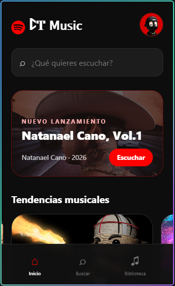
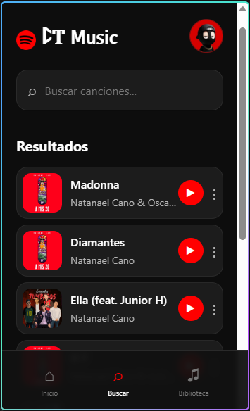
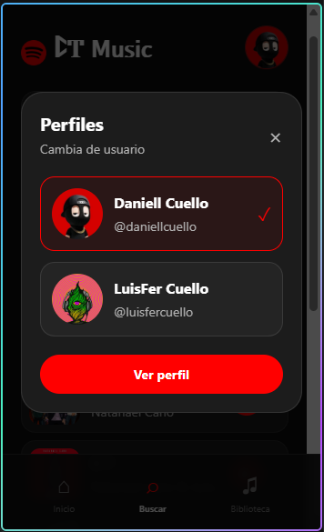

# ꛕͲ 𝖬𝗎𝗌𝗂𝖼

Aplicación móvil de música inspirada en las plataformas de streaming, enfocada en Corridos Tumbados. La interfaz utiliza una estética oscura con acentos rojos, portadas de álbumes y navegación sencilla para descubrir, buscar y reproducir música.

## Funcionalidades

- Inicio con buscador funcional.
- Franja de **Nuevo lanzamiento** para *Natanael Cano, Vol.1*.
- Carrusel horizontal de **Tendencias musicales** con cambio automático.
- Sección **Escucha algo nuevo** con varias recomendaciones.
- Biblioteca con 12 canciones de Natanael Cano, Junior H, Peso Pluma, Eslabón Armado, Fuerza Regida y más.
- Reproductor con audio real, portada, progreso, pausa, reanudación, anterior, siguiente, salto de posición y avance automático.
- Selector de perfiles con Daniell Cuello y LuisFer Cuello.
- Perfil completo con foto circular, usuario, seguidores, seguidos y playlists.

## Requisitos de la actividad

- `SafeAreaView` y `ScrollView`.
- `TextInput` funcional para buscar canciones.
- Imágenes remotas para portadas y banners.
- Imágenes locales para los perfiles.
- Componentes `Pressable` con estados de opacidad.
- Estilos realizados con NativeWind, sin `StyleSheet.create()`.

## Capturas

### Inicio



### Biblioteca y reproductor



### Perfil de usuario



## Instalación y ejecución

```bash
npm install
npx expo start
```

Para abrir la aplicación en Expo Go, escanea el código QR desde el teléfono. El computador y el teléfono deben estar conectados a la misma red Wi-Fi. Si la red local no funciona, utiliza:

```bash
npx expo start --tunnel
```

Comandos útiles durante el desarrollo:

- `w`: abrir la versión web.
- `a`: abrir en Android conectado.
- `i`: abrir en el simulador de iOS.

## Tecnologías

- Expo SDK 57
- Expo Router
- React Native
- TypeScript
- NativeWind
- expo-audio